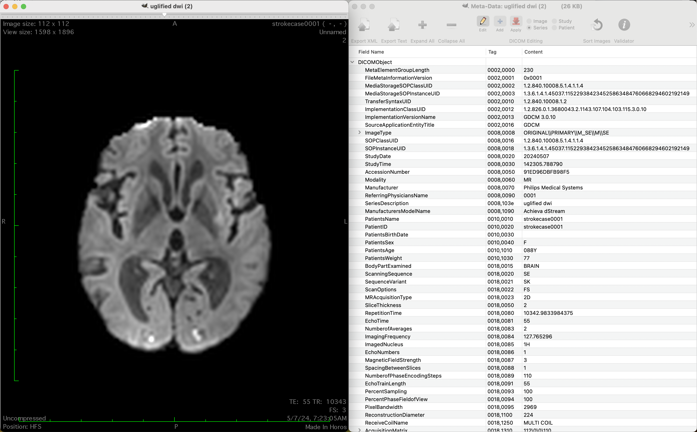

# un-BIDS



A.I. model training can be done with publicly available data. Image data are originally collected on medical scanners in DICOM format and some projects convert them into NIfTI (.nii, as in BIDS) before sharing. As I want A.I. to happen inside clinics here I try to convert such data back to the clinical DICOM format (research PACS). As much information is lost in the initial conversion this may create 'ugly' DICOM files.

```bash
./uglify -i data/ISLES-2022/sub-strokecase0001 -m data/ISLES-2022/derivatives/sub-strokecase0001 -o /tmp/bla
tree -L 3 /tmp/bla
/tmp/bla
└── strokecase0001
    └── 0001
        ├── 1_adc
        ├── 2_dwi
        ├── 3_FLAIR
        └── 4_msk
```

## Introduction

```bash
./uglify -o /tmp/brats_as_dicom data/brats/BRATS_280.nii.gz
```

### Example 1 - BRATS

The brats dataset has files that contain four different 3D volumes (4D .nii.gz). The call above will convert one of these files into a folder of DICOM with a single series (4 volumes with repeating slice locations).

### Example 2 - ISLES-2022

The ISLES-2022 dataset ([arXiv](https://arxiv.org/abs/2206.06694)) is an example volumetric medical imaging collection that contains images in the NIfTI format (extensions .nii.gz or .nii). Each .nii file may be acompanied by a side-loading javascript object notation (json) text file that contains a single object with key-value pairs. Here an example:

```json
{
  "dataset": "ISLES_22",
  "ImageType": [
    "ORIGINAL",
    "PRIMARY",
    "M_IR",
    "M",
    "IR"
  ],
  "Modality": "MR",
  "Manufacturer": "Philips Medical Systems",
  "ManufacturerModelName": "Achieva dStream",
  "PatientSex": "F",
  "PatientAge": "088Y",
  "PatientWeight": 77.0,
  "BodyPartExamined": "BRAIN",
  "ScanningSequence": "IR",
  "SequenceVariant": "SK",
  "ScanOptions": "FS",
  "MRAcquisitionType": "3D",
  "SliceThickness": 1.0,
  "RepetitionTime": 4800.0,
  "EchoTime": 272.629,
  "InversionTime": 1650.0,
  "NumberOfAverages": 2.0,
  "ImagingFrequency": 127.76528,
  "ImagedNucleus": "1H",
  "EchoNumbers": 1,
  "MagneticFieldStrength": 3.0,
  "SpacingBetweenSlices": 0.712,
  "NumberOfPhaseEncodingSteps": 250,
  "EchoTrainLength": 170,
  "PercentSampling": 77.9164810180664,
  "PercentPhaseFieldOfView": 100.0,
  "PixelBandwidth": 1305.0,
  "ReconstructionDiameter": 250.0,
  "ReceiveCoilName": "MULTI COIL",
  "AcquisitionMatrix": [
    0,
    252,
    250,
    0
  ],
  "FlipAngle": 90.0,
  "PatientPosition": "HFS",
  "AcquisitionDuration": 235.20001220703125,
  "DiffusionBValue": 0.0,
  "DiffusionGradientOrientation": [
    0.0,
    0.0,
    0.0
  ],
  "ImagePositionPatient": [
    -35.706329450628,
    -112.80021829155,
    131.362080136887
  ],
  "ImageOrientationPatient": [
    -0.0277779083698,
    0.9990165233612,
    -0.0345597974956,
    0.05153298750519,
    -0.0330959893763,
    -0.9981227517127
  ],
  "Rows": 352,
  "Columns": 352
}
```

Most of these tags represent actual DICOM tags (not "dataset"). The goal of this project is to generate new DICOM files that are valid (for a given PACS system) and contain the image data (from the .nii) and the header information (from the json). Such side-loading json files may not be present. In those cases we will assume some default settings and do our best.

Notice: If there are several .nii files found in the provided folder the tool will assume that all volumes belong to the same patient and DICOM study. This is only true if your folder really contains such volumes (anat, adc, dwi, ...).

Notice: In case that the NIfTI files contain 4D data the tool assumes that the volume index is the last (4th) dimensional value in the data.

Warning: The .nii files may contain not primary image data but derived data such as ADC. The value range of such measures may not conform to the DICOM coding used in this project. All .nii is converted to DICOM by first measuring minimum and maximum values (3D measure). The data is aftewards (linearly) scaled from 0 (minimum value) to 2^12=4096 (maximum value) before its stored as individual DICOM images. Notice that an ADC volume was probably first generated as part of the imaging session, saved as DICOM in a similar encoding and exported as .nii.

Warning: This approach is problematic because not all DICOM tags are present in the json file, only the once deemed useful by the original conversion tool (DICOM to .nii + .json) have been included. Our re-created DICOM files will therefore have missing information that might be required for data processing steps like minimally pre-processing. Even worse our generated DICOM files will pretend to be coming from a vendor without following their standard. A tool that tries to process or visualize such DICOM data might produce errors.

### Advanced usage

In case specific DICOM tags need to be overwritten with fixed values use the "--modify" option. If official DICOM tags are used (such as PatientID, PatientName) the provided values will be used instead of the default values.

```bash
uglify --verbose --modify "PatientID=PAT001" --modify "PatientName=PAT001" -o /tmp/output example.nii.gz
```

Data provided with the '-i,--raw-data' option (or provided at the end) are encoded as unsigned short values which is suitable for most raw image data. The option '-m,--mask-data' should be used instead if the image provided is a mask and no scaling of the intensities should be applied. Mask volumes are encoded in the input format, usually 0 for background and 1 for the first label.

```bash
./uglify -m data/ISLES-2022/derivatives/sub-strokecase0001 -o /tmp/bla/
```

### Build

Use cmake and create either a 'Release' (fast) or a 'Debug' build.

```bash
cmake -DCMAKE_BUILD_TYPE=Debug .
make
./uglify -h
Allowed options:
  -h [ --help ]          UGLIFY: Convert a BIDS like folder to DICOM.
  -V [ --version ]       Print the version number.
  -v [ --verbose ]       Print more verbose output during processing.
  -i [ --raw-data ] arg  Folder with nii.gz and .json files, or a single 
                         .nii/.nii.gz file.
  -m [ --mask-data ] arg Folder with nii.gz and .json files, or a single 
                         .nii/.nii.gz file.
  -o [ --outdir ] arg    Output directory for DICOM files
  -e [ --modify ] arg    Modify individual DICOM tags ("PatientID=MEME"). This 
                         option can be used more than once.
```

To convert a folder like ISLES-2022 ([DOI](https://doi.org/10.5281/zenodo.7153326), [[arXiv](https://arxiv.org/abs/2206.06694)):

```bash
for u in {1..250}; do 
   a=$(printf '%04d' $u); 
   ./uglify -i data/ISLES-2022/sub-strokecase${a} -m data/ISLES-2022/derivatives/sub-strokecase${a} -o /tmp/bla/
done
```

The resulting directory tree looks like this:

```bash
/tmp/bla/
├── mapping.csv
├── strokecase0001
│   └── 0001
│       ├── 1_adc
│       ├── 2_dwi
│       ├── 3_FLAIR
│       └── 4_msk
...
```

Each of the sub-directories contains an individual series of DICOM files with the SeriesNumber 1, 2, 3, and 4 and a term derived from the NIfTI filename (adc/Apparent Diffusion Coefficient, dwi/Diffusion weighted images, FLAIR, msk/mask). 

The 'mapping.csv' contains DICOM identifiers (generated randomly):

```csv
subjectid,eventname,AccessionNumber,StudyID,StudyInstanceUID
"strokecase0001","0001","0BFC6DC34FC9","0BFC6DC34FC9",1.3.6.1.4.1.45037.293108160657373275758438834236443259654
...
```

